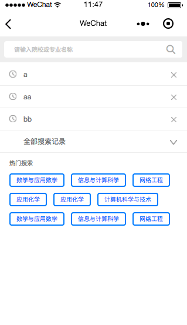
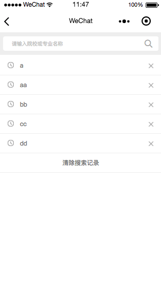

# searchUI 🔍

-  微信小程序优雅的搜索框


## 特性

- [x] 不吹不黑-我们的界面UI还是蛮漂亮的
- [x] 支持搜索历史
- [x] 支持搜索历史（记录）缓存
- [x] 支持热门搜索
- [x] 支持删除搜索记录、清空搜索记录

##计划
1. searchUI 2.0
将封装为组件的方式，替代template模板方式，耦合性更好，方便引用

## 效果




## 使用
#### 1.将component下的wxSearch放入项目中
#### 2.引入wxSearch的方法
	```js
		import * as wxSearch from '../../component/wxSearch/wxSearch';

		onLoad: function (options) {
	    	//初始渲染-读取storage的历史记录
	    	wxSearch.init(this)
	  	}
	```
#### 3.引入wxSearch的模板文件
	```js
		<import src="/component/wxSearch/wxSearch"></import>

		<template is="wxSearch" data="{{...tabData}}"></template>
	```
#### 4.引入wxSearch的样式文件
	```js
		@import '../../component/wxSearch/wxSearch'
	```

## 说明

* 使用WXML提供的template，来做组件的封装
* 不定期更新，围绕易用性和可扩展性提升优化
* 喜欢请start，您的支持就是我的动力…

* 项目地址: [https://github.com/mrzhang90/searchUI](https://github.com/mrzhang90/searchUI)
  
